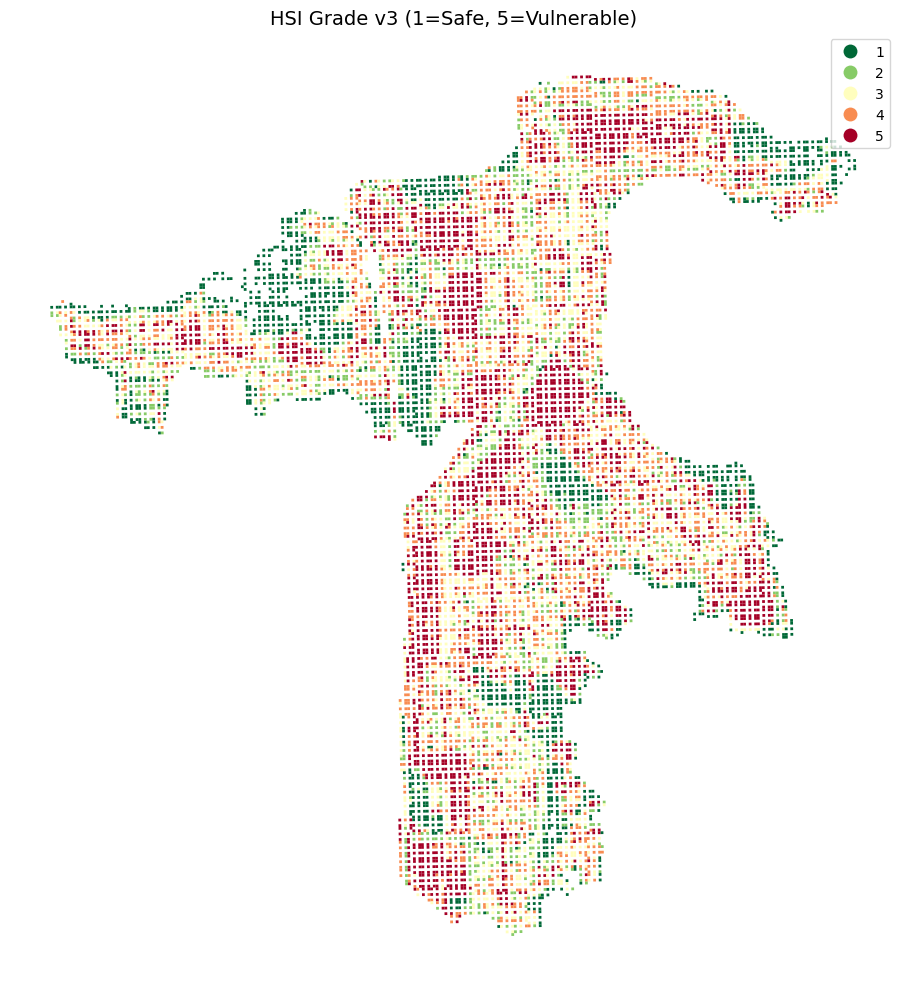
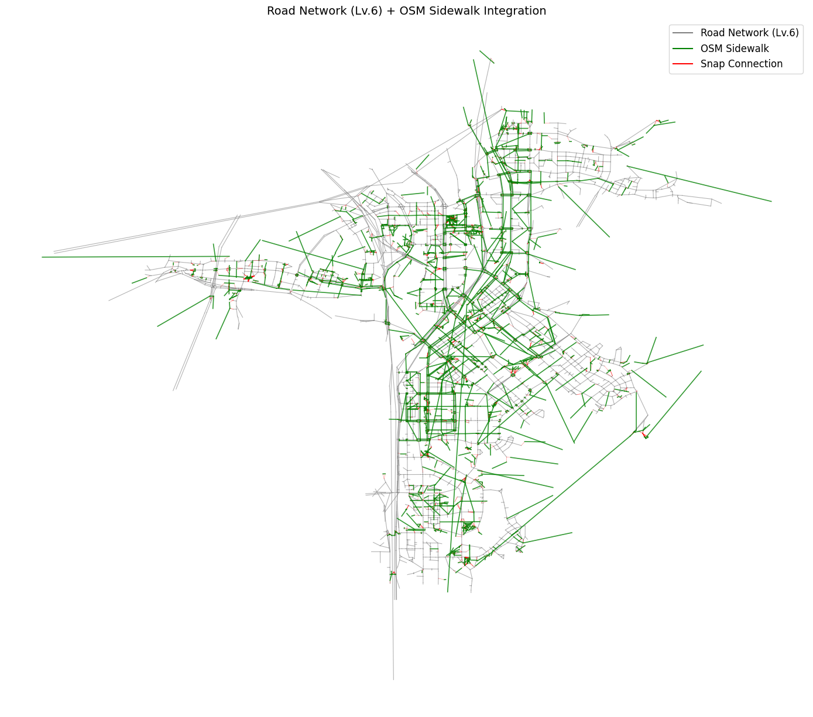
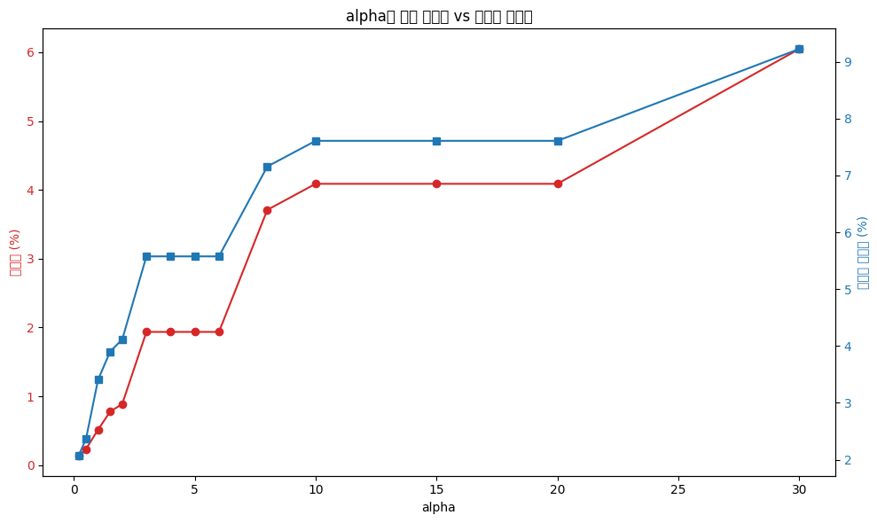

# 🌡️ 보행 열노출 진단 및 더위회피 우선관리지역 도출 — 판교·분당

> LH COMPAS 공모전 · 팀 프로젝트 (팀 리더) · 2026

기존 폭염 대응은 무더위쉼터·그늘막 같은 **개별 시설의 위치와 개수** 중심이라,
사람들이 실제로 걷는 길에서 얼마나 더위에 노출되는지는 보지 못했습니다.

이 프로젝트는 **"이동 중 열노출"** 관점에서 판교·분당의 보행 동선을 진단하고,
더위를 피할 수 없는 구간을 찾아 그늘막·쉼터를 우선 설치할 지역을 제안했습니다.

## Pipeline

```
30m 격자 HSI(열 스트레스 지수) → 보행 네트워크 → 더위회피 경로 → 곤란구간 → 우선관리 링크
```

### 1. HSI (Heat Stress Index) — 30m 격자 11,388개
- 212개 원천 지표 → **5단계 필터링** → 노출(E)·민감도(S)·적응역량(A) **3축 14개 지표**
- 분포 유형별 표준화 차등 적용 (정규형: min-max / 쏠림형: log1p + min-max / A축은 분모 역할이라 하한 ε=0.01)
- 축별 **PCA(PC1)** → 축 간 **엔트로피 가중치** → `HSI = w_E·E + w_S·S − w_A·A`
- 5등급 분류: Jenks 자연구간 (1차원 KMeans 근사)

| 축 | 지표 | 엔트로피 가중치 |
|---|---|---|
| E 노출 | 지표면온도(LST), 기온(IDW), 풍속, 상대습도 | 0.13 |
| S 민감도 | 시가화비율, 낮 시간 방문인구, 고령인구, 점심 직장인구, 어린이집, 노인시설 | 0.43 |
| A 적응역량 | NDVI, 녹지비율, 폭염 대응시설(공원·그늘막·쉼터), 가로수 길이 | 0.44 |



### 2. 보행 네트워크 구축
- 공공 상세도로망(Lv.6)은 차도 중심이라 인도 정보가 없음
- **OSM 인도(footway·path·pedestrian·steps)를 결합**하고 100m 반경으로 스냅(cKDTree)해 연결
- 최대 연결 컴포넌트 기준 노드 7,243 · 엣지 9,930, **원본 도로망 노드 99.6%(2,729/2,740) 보존**
- 링크 HSI: 링크 12m 버퍼와 격자의 면적가중평균



### 3. 더위회피 경로 분석
- 4개 역(야탑·서현·미금·판교) × 4개 사분면 = **16개 생활권 동선**
- `Cost = 거리 × (1 + α × 링크 HSI)` 로 최단경로와 더위회피경로를 비교 (Dijkstra)
- α 0.2~30 스캔 → **α = 10 채택** (평균 우회 65m · 우회율 4.1% · 열노출 저감 7.6%)
  - α 10 → 30으로 올려도 저감률은 1.6%p만 증가 → 효율이 꺾이는 지점



### 4. 더위회피 곤란구간 도출
- **조건 A (열노출 지속형)**: 회피경로로 돌아가도 HSI 상위 20%가 계속되는 동선
- **조건 B (과도한 우회형)**: 더위를 피하려면 300m 이상 돌아가야 하는 동선
- → 16개 동선 중 **곤란구간 5개** 도출

### 5. 우선관리지역 제안
- `곤란구간 HSI × 취약인구노출량 × 기존시설미비도` 로 **링크 단위 우선순위** 산출
- 상위 11개 링크를 로드뷰로 현장 검증
- 상위 8개 중 6개가 **판교역 동안사거리 ~ 봇들교사거리** 반경 200m에 밀집 → 개별 지점이 아닌 **광역 우선관리구역**으로 통합 제안

### 6. 3기 신도시 적용 (팀)
판교·분당 곤란 패턴을 왕숙1·창릉 계획도면에 대입해 사전 진단

## Key Insights
- 대부분의 동선은 **10~40m 정도의 작은 우회**만으로 열노출을 5~16% 줄일 수 있음
- 곤란구간은 원인이 달라 대책도 달라야 함
  - 열노출 지속형 (시가화 83~94%): 피할 길이 없음 → **최단경로 위에 그늘막·쉼터 직접 설치**
  - 과도한 우회형 (시가화 69~77%): 시원한 길이 멀리 있음 → **지름길·보행연결로 신설**
- 두 유형 모두 폭염 대응 시설 지표가 0.07~0.12로 매우 낮음

## Trial & Error
- **LST가 묻히는 문제**: E축 4개 지표를 PCA로 한 번에 묶었더니, 함께 움직이는 기상 변수 3개가 PC1을 지배해 가장 변별력 큰 LST의 적재값이 0.049에 그침
  → LST와 기상 변수를 서브그룹으로 분리한 뒤 엔트로피로 재결합해 **LST 비중 45.9%** 로 개선
- **걸을 길이 없는 도로망**: 차도 중심 공공 도로망에 OSM 인도를 결합·스냅해 보행 동선 재현
- **α 선택**: α를 키울수록 열은 더 피하지만 우회가 급증 → 효율지수(저감률/우회율)가 꺾이는 지점으로 결정

## My Contributions
- 팀 리더로서 분석 프레임워크 설계 및 전체 흐름 총괄
- **HSI 산정 전 과정**: 지표 선정, 분포별 표준화, 축별 PCA, 엔트로피 가중치, 등급화
- **보행 네트워크 구축**, 16개 동선 설정, 비용함수 설계 및 최적 α 도출
- **곤란구간 판정 기준** 수립 (조건 A·B, 300m 임계값)
- 3단 스코어링 결합 및 로드뷰 현장 검증

## Notebooks
| 단계 | 노트북 | 내용 |
|---|---|---|
| 데이터 | `00_population_preprocess` | 유동·직장·방문·서비스인구 → 30m 격자 통합 |
| | `07_merge_master_grid` | 인구·시설·위성지표 마스터 테이블 (212개 지표) |
| HSI | `09_hsi_indicator_selection` | 5단계 지표 필터링 (212 → 14) |
| | `10_hsi_standardization` | 분포별 표준화 |
| | `11_hsi_v2_e_axis` | E축 기온 추가, CRITIC 가중치 비교 |
| | `13_hsi_v3_final` | **최종 HSI** (기상 변수, E축 서브그룹 PCA, 엔트로피, 등급화) |
| 경로 | `08_route_candidates` | 동선 후보 탐색 |
| | `12_walk_network_alpha` | **보행 네트워크 · α 스캔 · 곤란구간 후보** |
| | `14_difficult_segments` | 곤란구간 좌표·역세권 제외·3축 프로파일 |
| | `16_priority_scoring` | **조건 A·B 판정 · 링크 단위 우선순위** |
| 시각화 | `15_figures` | 보고서용 그림 |

> 노트북 용량 때문에 folium 지도 출력은 제거했습니다.

## Data
LH COMPAS 공모전 플랫폼 제공 데이터(격자·인구·도로망·위성지수 등)와 OpenStreetMap을 사용했습니다.
공모전 데이터는 재배포가 제한되어 repo에 포함하지 않았습니다.

## Tech Stack
Python · GeoPandas · NetworkX · scikit-learn (PCA, KMeans) · SciPy (cKDTree) · Folium · Matplotlib
